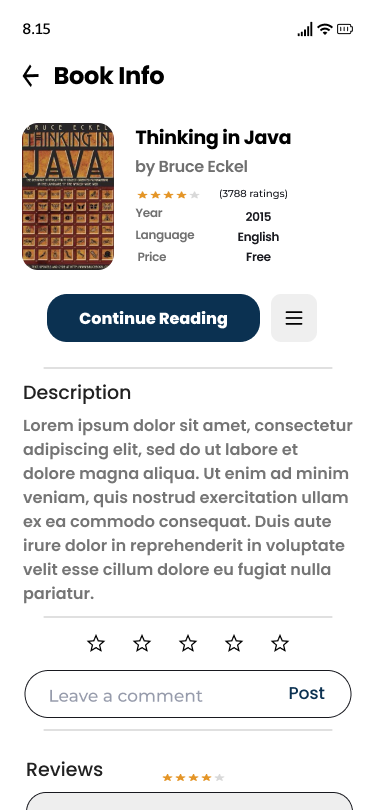
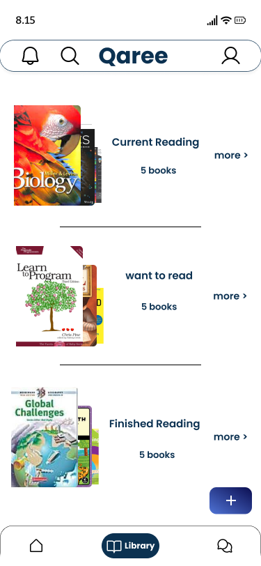
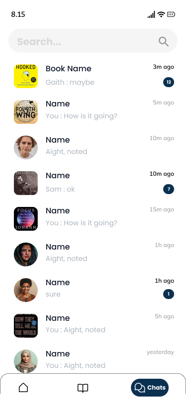
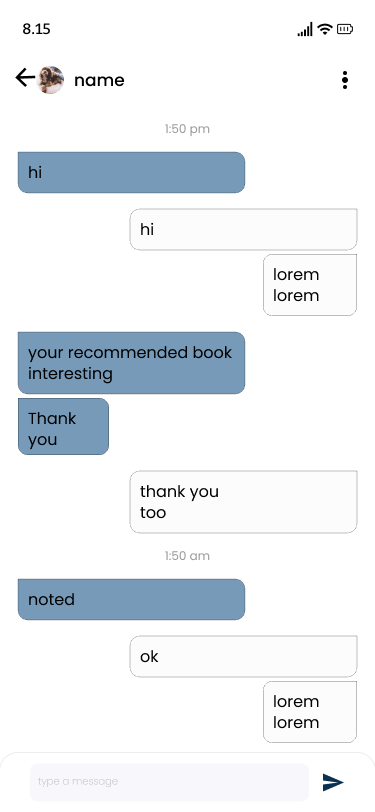

# Qaree - E-Book Reading App

Welcome to Qaree, the ultimate e-book reading app that enhances your reading experience with a variety of powerful features and a sleek, user-friendly interface. This README file will guide you through the app's features and architecture.

## Features

- **MVVM Architecture**: Ensures a clear separation of concerns, making the app more modular, testable, and maintainable.
- **Clean Architecture**: Promotes a scalable and maintainable codebase by separating the app into layers.
- **Multi-Module**: Modularized project structure to improve build times and maintainability.
- **GraphQL**: Efficient data fetching and manipulation with a modern query language.
- **Shimmer Animation**: Enhances user experience by providing a visual hint of loading content.
- **DataStore**: Provides a robust solution for data storage.
- **Dagger Hilt**: Dependency injection framework to manage dependencies efficiently.
- **Coil**: Fast and lightweight image loading library for Android.
- **Palette**: Extracts prominent colors from images to create dynamic UI themes.
- **Retrofit**: Type-safe HTTP client for Android and Java.
- **Parcelable**: Optimized serialization for passing complex data between activities.
- **FCM (Firebase Cloud Messaging)**: Enables push notifications to engage users.
- **Payment Integration**: Supports payments via PayPal and credit cards.
- **UI Modes**: Light and Dark mode for a comfortable reading experience.
- **Languages**: Supports English and Arabic for a broader audience.
- **Paging3**: Efficiently loads paginated data for a smooth scrolling experience.
- **Communication**: Enables one-to-one chats with readers and authors, and participation in book communities (such as simple chat groups).

## Screenshots

Here are some screenshots from the Qaree app:

### Light Mode

## Comparing MVVM with Other Architecture Patterns

### MVVM (Model-View-ViewModel)

- **Separation of Concerns**: Divides the application into three main components, promoting a clear separation of concerns.
- **Testability**: Facilitates unit testing of business logic.
- **Two-Way Data Binding**: Simplifies the synchronization between the UI and the underlying data.
- **Flexibility**: Adapts well to changing requirements and complex UI interactions.

### MVC (Model-View-Controller)

- **Separation of Concerns**: Less separation compared to MVVM; the Controller often becomes a mix of UI and business logic.
- **Testability**: Testing can be more challenging due to the tight coupling of components.
- **Simplicity**: Easier to understand and implement for simple applications.
- **Scalability**: Can become unwieldy with complex applications due to less modularity.

### MVP (Model-View-Presenter)

- **Separation of Concerns**: Better separation than MVC, with the Presenter handling business logic.
- **Testability**: Easier to test than MVC, but still requires mocking of the View.
- **Single Responsibility**: Presenter has a single responsibility, making it easier to manage.
- **View-Presenter Communication**: Requires manual synchronization between the View and the Presenter.

### MVI (Model-View-Intent)

- **Unidirectional Data Flow**: Promotes a clear flow of data, making state management predictable.
- **Testability**: High testability due to the isolation of business logic in Intents.
- **Complexity**: Can be complex to implement and understand, especially for newcomers.
- **State Management**: Explicit state management can make the app more robust.

## Comparing Coil, Glide, and Picasso

### Coil

- **Performance**: Fast and efficient, optimized for Kotlin and Coroutines.
- **Modern Features**: Supports animations, transformations, and easy integration with Compose.
- **Lightweight**: Smaller footprint compared to Glide and Picasso.
- **Ease of Use**: Simple API, designed with Android's modern development practices in mind.

### Glide

- **Performance**: Very fast, with effective memory and disk caching.
- **Features**: Rich set of features including GIF support, video stills, and complex image transformations.
- **Flexibility**: Highly customizable with extensive configuration options.
- **Community Support**: Widely used with extensive documentation and community support.

### Picasso

- **Simplicity**: Easy to use with a straightforward API.
- **Performance**: Good performance, but not as optimized as Glide for handling large images or complex transformations.
- **Caching**: Effective memory and disk caching mechanisms.
- **Stability**: Proven track record with stable performance over time.

### Comparison Summary

- **Performance**: Glide > Coil > Picasso
- **Ease of Use**: Picasso > Coil > Glide
- **Features**: Glide > Coil > Picasso
- **Modern Development**: Coil > Glide > Picasso

## Architecture

Qaree follows Clean Architecture principles, ensuring a high-quality codebase that is both scalable and maintainable:

- **Presentation Layer**: Contains UI components and ViewModels.
- **Domain Layer**: Contains business logic and use cases.
- **Data Layer**: Manages data sources and repositories.

## Project Structure

Qaree is structured as a multi-module project for better separation of concerns and scalability. The main modules include:

- `app`: Manages UI components and user interactions.
- `data`: Handles data management and repository implementations.
- `domain`: Contains use cases and business logic.

Happy reading with Qaree!
