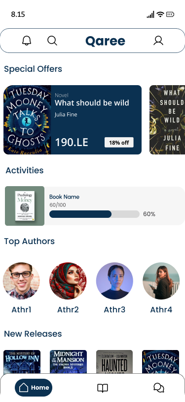

# Qaree - E-Book Reading App

Welcome to Qaree, the ultimate e-book reading app that enhances your reading experience with a variety of powerful features and a sleek, user-friendly interface. This README file will guide you through the app's features and architecture.

## Features

- **MVVM Architecture**: Ensures a clear separation of concerns, making the app more modular, testable, and maintainable.
- **Clean Architecture**: Promotes a scalable and maintainable codebase by separating the app into layers.
- **Multi-Module**: Modularized project structure to improve build times and maintainability.
- **GraphQL**: Efficient data fetching and manipulation with a modern query language.
- **Shimmer Animation**: Enhances user experience by providing a visual hint of loading content.
- **DataStore**: Provides a robust solution for data storage.
- **Dagger Hilt**: Dependency injection framework to manage dependencies efficiently.
- **Coil**: Fast and lightweight image loading library for Android.
- **Palette**: Extracts prominent colors from images to create dynamic UI themes.
- **Retrofit**: Type-safe HTTP client for Android and Java.
- **Parcelable**: Optimized serialization for passing complex data between activities.
- **FCM (Firebase Cloud Messaging)**: Enables push notifications to engage users.
- **Payment Integration**: Supports payments via PayPal and credit cards.
- **UI Modes**: Light and Dark mode for a comfortable reading experience.
- **Languages**: Supports English and Arabic for a broader audience.
- **Paging3**: Efficiently loads paginated data for a smooth scrolling experience.
- **Communication**: Enables one-to-one chats with readers and authors, and participation in book communities (such as simple chat groups).

## Screenshots

Here are some screenshots from the Qaree app:

### Light Mode
<table>
  <tr>
    <td></td>
   <td> </td>
 <td>  </td>
<td>  </td>
 <td>  </td>
 <td>    </td>
  </tr>
</table>

### Dark Mode
<table>
  <tr>
    <td></td>
   <td> </td>
 <td>  </td>
<td>  </td>
 <td>  </td>
 <td>    </td>
  </tr>
</table>

## About MVVM arch

### MVVM (Model-View-ViewModel)

- **Separation of Concerns**: Divides the application into three main components, promoting a clear separation of concerns.
- **Testability**: Facilitates unit testing of business logic.
- **Two-Way Data Binding**: Simplifies the synchronization between the UI and the underlying data.
- **Flexibility**: Adapts well to changing requirements and complex UI interactions.

### Libraries & Tools Used

## Project Structure

Qaree is structured as a multi-module project for better separation of concerns and scalability. The main modules include:

- `app`: Manages UI components and user interactions.
- `data`: Handles data management and repository implementations.
- `domain`: Contains use cases and business logic.

Happy reading with Qaree!
